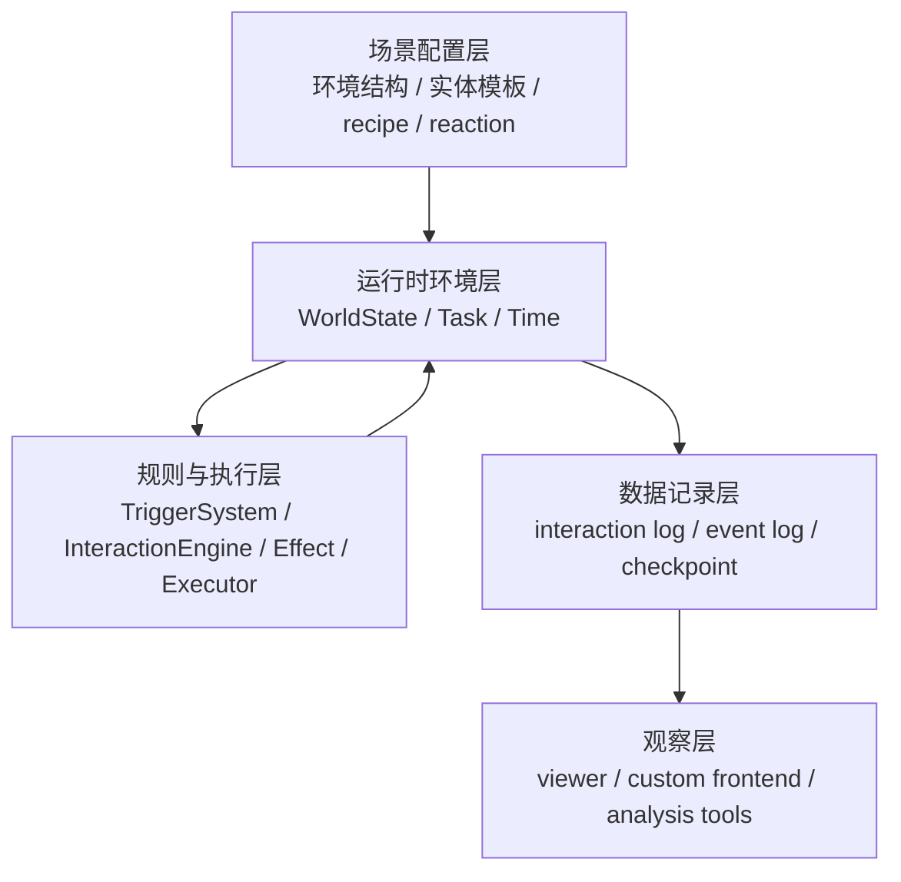
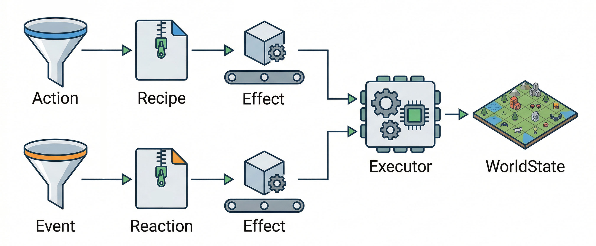

# KERN 技术报告

## 1. 简介

KERN（Knowledge, Environment, Runtime, Narrative）是一个基于 ECS 与数据驱动的离散事件仿真（Discrete-Event Simulation, DES）沙盒内核。它为多智能体强化学习与大语言模型研究提供了一个可配置、可重载、可观察的系统底座。

在传统多智能体实验中，场景结构、交互逻辑与状态更新流程往往被直接硬编码。这种做法导致系统设计成本高、复用性差，每当研究者需要调整地点布局、任务结构或交互规则时，都需要修改核心逻辑并重新梳理执行链。

KERN 的核心设计目标是将规则定义与执行逻辑解耦，提供一个统一的框架，帮助用户在不修改核心代码的前提下快速设计、运行和调整仿真沙盒。具体而言，系统实现了以下特性：

- **数据驱动的世界状态定义**：仿真系统中的所有实体均由 JSON 配置驱动。例如，一个“苹果”实体无需单独编写代码类，仅需在 JSON 中组合 `EdibleComponent`（食用属性）与 `TagComponent`（标签属性）。地点的拓扑结构也通过离散节点与路径的配置数据实现。
- **快速重载的迭代流**：支持基于 Checkpoint 文件的状态恢复。若需调整某个实体的数值参数，研究者只需修改 JSON 并加载前一 Tick 的快照，即可在同一进度下直接验证新参数，缩短实验闭环。
- **稳定的离散执行机制**：采用离散 Tick 驱动，确保环境推进、状态结算与日志记录的一致性。所有的动作耗时、状态变化都以整数 Tick 为步长，保证物理过程的绝对可复现。
- **标准化的观察接口**：输出规范的日志与快照数据，使底层内核与可视化前端解耦。前端只需消费按 Tick 生成的 JSON 数据结构，即可完成渲染逻辑。

**temp 阶段小结**：本节描述的核心目标与四项特性已经在当前代码版本中有对应实现基础，属于可以作为当前版本能力进行陈述的内容。其中“可观察”与“可重载”已经具备运行时支撑，“对外展示形式”仍可继续补强。

## 2. 系统总体架构

KERN 采用分层组织方式。系统从配置读取开始，经过运行时环境、规则执行和日志输出，最终把结果交给观察层消费。



1. **场景配置层**：定义系统运行所需的静态数据。通过 JSON 定义房间布局、实体种类及其挂载的组件集。这一层承载实验内容，使不同场景可共享底层引擎。
2. **运行时环境层**：承载仿真中的实际状态。采用 ECS（Entity-Component-System，实体-组件-系统）架构组织数据。在 ECS 的设计原则中，**实体（Entity）**仅是一个唯一的 ID，**组件（Component）**是承载纯数据的积木块（如生命值、标签），而**系统（System）**则是处理这些数据的纯逻辑单元。通过将不同的组件“拼装”到实体上，系统能在不编写新类的情况下定义出千变万化的角色或物品。系统启动时解析配置并构建统一的 `WorldState`（包含所有实体、地点、任务的集合），在后续 Tick 中持续更新。
3. **决策与交互层**：连接环境状态与智能体行为。负责收集环境感知（Perception）并生成动作（Action），由交互引擎将动作映射为具体的规则（Recipe）与执行指令（Effect）。
4. **数据记录层**：保存运行记录。包含记录交互叙事的 `interaction log`、环境事件的 `event log`，以及按 Tick 截取的环境状态快照 `checkpoint`。
5. **可视化与分析层**：负责图形界面展示与数据分析。该层独立于仿真内核，仅消费记录层输出的数据。

**temp 阶段小结**：本节中的配置加载、世界构建、规则执行与日志记录主链路已经实现，属于当前版本的稳定骨架；其中“可视化与分析层”目前主要体现为解耦的数据输出接口和辅助工具，完整展示形态仍可继续完善。

## 3. 仿真沙盒与规则机制

KERN 采用配置定义底层沙盒。当前状态空间由地点、路径、实体、组件、任务和规则组成。地点与路径定义离散空间，实体通过组件表达角色、物品、容器和状态等语义，任务表示跨 Tick 的持续行为。

在规则层，KERN 引入 recipe、reaction 和 effect 三个核心概念。



*(图：Agent 的主动动作与环境的被动事件分别通过 Recipe 和 Reaction 匹配，最终转化为统一的 Effect 结构化指令，汇入执行引擎完成世界状态的修改)*

### 3.1 规则定义（Recipe 与 Reaction）

- **recipe（主动交互规则）**：描述角色的主动行为。当角色发起动作（如 `Attack`）时，系统检查 `selector`（如执行者需持有武器）和 `condition`（如目标在同一房间）。匹配成功后，系统根据 `outputs` 字段生成 effect（如扣除目标生命值）。
- **reaction（事件触发规则）**：描述环境的被动响应。无需硬编码回调函数，规则通过 JSON 声明式定义。例如，环境推进时间的规则定义如下：
  ```json
  {
      "on_event": "AdvanceTick",
      "condition": { "type": "has_component", "component": "StatusComponent" },
      "effects": [ { "effect": "StatusTick" } ]
  }
  ```
  任何挂载了状态组件（如饥饿、流血）的实体，在收到 `AdvanceTick` 事件时，系统会自动生成 `StatusTick` 的 Effect 进行状态结算。

### 3.2 状态执行机制（Effect 与架构取舍）

**effect** 描述一次结构化的状态写操作（如 `MoveEntity`、`ModifyProperty`）。在 KERN 中，主动行为和被动反应都不会直接修改环境状态，它们必须先生成 effect 指令，再由统一执行器（`WorldExecutor`）落地到 `WorldState`。

**架构取舍：**
在设计状态更新机制时，系统在“内存对象直写（如 `entity.hp -= 10`）”与“结构化指令分发”之间做出了取舍。KERN 选择了强制所有状态写操作必须通过 Effect 结构（如 `{"effect": "ModifyProperty", "property": "hp", "change": -10}`）提交给执行器。
这种设计牺牲了少量的执行效率，并增加了编写新规则的配置量，但换来了物理过程的严格可审计性。由于所有副作用均被拦截并结构化，环境避免了隐式数据损坏或并发脏读问题，且每个状态变更都能生成一致的日志记录。

### 3.3 Effect 指令的生命周期

为了保证世界状态变更的绝对安全与可溯源，每一条 Effect 从生成到落地，都必须经历一个严格的生命周期：
1. **生成**：智能体的合法动作匹配 `Recipe` 后，或环境事件匹配 `Reaction` 后，生成原始的 Effect JSON 对象。
2. **输入归一化与校验（Binding）**：进入执行器前，`Binder` 会拦截该指令，进行参数补全与类型校验（如检查 `MoveEntity` 是否包含必要的源地址和目标地址）。非法指令会直接抛出 `BindError`。
3. **实体解析与上下文合并**：将指令中的抽象引用（如 `param:target_id`）解析为环境中真实的实体对象。若目标实体已在上一Tick中被销毁，指令将被安全拦截。
4. **状态落地与事件派发**：特定的 `Handler` 负责修改 `WorldState` 的内存数据。修改成功后，强制向引擎主循环派发对应的底层环境事件（如 `EntityMoved`），该事件将自动记录到全局的 `Event Log` 中，供复盘与回放使用。

**temp 阶段小结**：本节是当前版本最扎实的已实现部分之一，已经由现有代码直接支撑，可以作为报告中的核心技术主张。

## 4. 运行流程与异常控制

KERN 使用离散 Tick 推进环境。每个 Tick 遵循固定的运行顺序：

1. 系统推进全局时间，并向环境中所有实体广播 `AdvanceTick` 事件。
2. 实体上的各类状态通过匹配普通 reaction 转化为具体的扣除 effect。
3. 智能体触发决策 reaction 进行感知和规划，输出具体的动作指令（如 `{"verb": "Move", "target_id": "医务室"}`）。该动作进入交互引擎匹配 recipe。
4. 若动作属于耗时操作，系统生成 `CreateTask` effect，将该动作转化为占用多个 Tick 的任务流。
5. 所有的 effect 汇入WorldExecutor，也就是执行器。执行器修改 `WorldState`，并将更新结果写入事件日志和本轮 Tick 的 checkpoint。

**边界防护与异常处理：**
为保证引擎稳定性，系统引入了 `max_trigger_depth` 机制。当 Trigger 递归触发 Reaction 时（例如事件 A 触发 B，B 再次触发 A），深度限制会阻断规则死循环。同时，每个 Effect 在执行前必须经过参数归一化校验，非法指令会产生标准的 `BindError` 或 `ExecutorError` 记录在日志中，而不会导致系统崩溃。

**temp 阶段小结**：本节在当前版本中已经形成闭环，属于可以直接陈述的已实现能力。

## 5. 第三方智能体接入协议

KERN 旨在提供一个高扩展性的开放测试床。系统内核不对智能体（Agent）的具体算法做任何假设。在内核视角下，大语言模型控制的角色与环境中的普通实体没有本质区别。

如果研究者需要接入自定义的 LLM 流程、强化学习算法或行为树，无需修改引擎运行代码，仅需利用现有架构完成以下两步：

1. **订阅感知**：在配置文件中注册一个 Reaction，订阅 `AdvanceTick` 事件。在触发时，读取当前暴露的 `WorldState` 实例（`ws`），构建所需的感知数据字典（如提取当前房间的可见实体和自身背包数据）。
2. **输出动作**：外部算法基于感知数据进行推理，最终只需返回符合规范的 JSON 动作数组（如 `[{"verb": "Move", "target_id": "target_entity_id"}]`）。内核会自动校验合法性，并将其转化为底层的 Effect 序列。

这种控制反转设计，使得 KERN 能够作为纯粹的沙盒环境，无缝适配外部各类智能体决策算法。

### 5.1 基于容器嵌套层级的视野可见性计算

在智能体的第一步“感知”过程中，KERN 并非简单地将整个环境状态一股脑抛给大语言模型（这会导致灾难性的 Token 消耗与信息作弊），而是设计了一套严格的**视野可见性计算机制**。
内核基于空间拓扑与实体的嵌套关系（`ContainerComponent`）来计算视线遮挡。例如：
- 如果 Agent 身处“医务室”，他只能看到同属“医务室”的顶级实体。
- 只有当“医务室”里的柜子配置了 `transparent: true`（透明），或者 Agent 拥有开启该柜子的动作权时，系统才会递归展开该柜子内部的实体列表。
这套原生的感知裁剪算法，在物理层面上屏蔽了不合理的信息泄露，保证了多智能体博弈中的信息不对称性。

### 5.2 语义与物理的隔离

在智能体的第二步“输出动作”过程中，KERN 系统针对大语言模型可能出现的“动作幻觉”（例如模型试图“杀死”一个不在房间里的实体，或者“拿起”一个无法拾取的背景板）设计了强力的拦截网。

当大模型输出一个 JSON 动作时，该动作首先进入**交互引擎（InteractionEngine）**进行验证。通过匹配对应的 `Recipe`，系统会执行基于声明式条件的逻辑评估（例如检查 `self` 是否持有必要的工具）。只有通过以上语义检查后，动作才会被翻译为底层的 Effect 指令并发送给执行器。

这种“语义与物理双重隔离防护层”，允许大语言模型在安全的框架内自由发散与探索，即便生成了错误的规划，系统也能将其记录为一次“失败的交互尝试”并反馈给模型的短期记忆（用于下一次反思修正），而不会导致底层沙盒物理状态的崩塌。

**temp 阶段小结**：本节中的感知裁剪、动作校验与“LLM 负责决策、执行器负责落地”的基本链路已经存在于当前实现中；但若要将其表述为一个完全稳定的“第三方智能体接入协议”，仍建议保持保守措辞，更适合定位为已具雏形、正在收敛的接入架构。

## 6. 应用场景

KERN 当前通过两个场景验证了其内核能力：

1. **农场场景（基础生产与交易）**：低复杂度测试环境。测试玩家移动到商店、购买种子（触发资源交换 Effect）、并在空地种植（Recipe 匹配生成农作物实体）。验证了实体移动、资源流转等基础交互链路。
2. **太空狼人杀场景（复杂多智能体博弈）**：高复杂度测试环境。测试内奸破坏平民任务、暗杀平民，并观察平民智能体基于有限信息推理寻找内奸。验证了在信息不对称、多角色冲突对抗以及复杂事件传播条件下的内核稳定性。

两个场景共用同一套 Tick 推进、规则匹配、执行和日志输出机制。变化部分仅限于 JSON 配置数据与规则定义，底层执行框架保持一致。

**temp 阶段小结**：本节对应的双场景复用能力已经在当前代码与运行配置中落地，是支撑“同一内核、不同场景”这一论点的主要证据。当前仍欠缺的是更系统的实验记录与对比数据，而不是场景本身是否存在。
