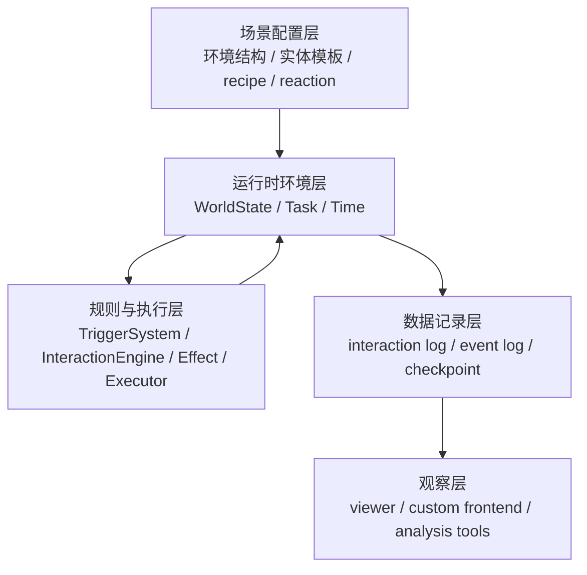
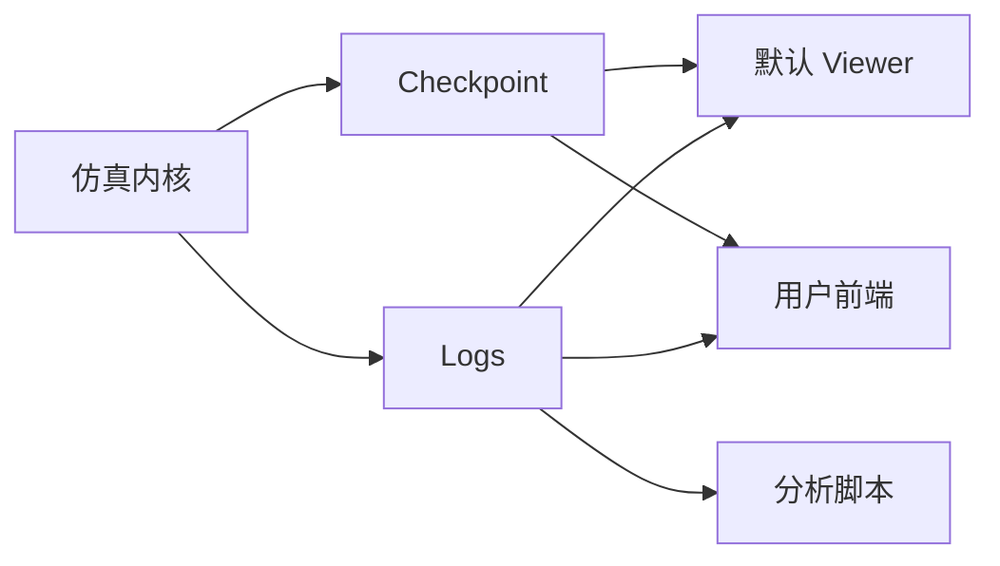

# KERN 技术报告

## 1. 简介

KERN（Knowledge, Environment, Runtime, Narrative）是一个基于 ECS 与数据驱动的离散模拟环境内核。它为多智能体与仿真实验提供了一个可配置、可重载、可观察的系统底座。

在传统多智能体实验中，场景结构、交互逻辑与状态更新流程往往被直接硬编码。这种做法导致环境设计成本高、复用性差，每当研究者需要调整地点布局、任务结构或交互规则时，都需要修改核心逻辑并重新梳理执行链。

KERN 的核心设计目标是将环境定义与执行逻辑解耦，提供一个统一的框架，帮助用户在不修改核心代码的前提下快速设计、运行和调整模拟环境。具体而言，系统实现了以下特性：

- **数据驱动的环境定义**：举例来说，模拟环境中的“苹果”不需要写一个单独的类，而是通过 JSON 定义一个包含 `EdibleComponent`（可食用）和 `TagComponent`（标签：水果）的数据集合；场景中的“厨房”则是定义了相邻连接路径的地点节点。
- **快速重载的迭代流**：支持“配置重载 + Checkpoint 恢复”的快速回环。如果研究者修改了“苹果”恢复饥饿度的数值，直接加载先前的快照文件（Checkpoint）即可在同一场景进度下测试新数值。
- **稳定的离散执行机制**：采用离散 Tick 驱动，确保环境推进、状态结算与日志记录的一致性。例如，所有的动作耗时、状态变化都以 1 Tick 为最小步长推进，保证了物理过程的绝对可复现。
- **标准化的观察接口**：输出规范的日志与快照数据，使底层内核与任意可视化前端完全解耦。前端只需要读取每个 Tick 生成的 JSON 数据即可渲染对应的 2D 或 3D 画面。

## 2. 系统总体架构

KERN 采用分层组织方式。系统从配置读取开始，经过运行时环境、规则执行和日志输出，最终把结果交给观察层消费。

1. **场景配置层**：定义系统运行所需的静态数据。例如，配置“太空舱”的房间布局，以及不同房间内初始生成的“储物柜”的种类。这一层承载具体的实验内容，使不同实验场景能够共享同一套底层引擎。
2. **运行时环境层**：承载仿真中的实际状态。基于 ECS（Entity-Component-System）风格组织数据，实体类型与能力通过组件组合表达。例如，一个“内奸”角色挂载了 `CreatureComponent`（生命体征）、`AgentControlComponent`（受控标识）和 `TagComponent`（标签：内奸）。系统启动时解析配置并构建统一的 `WorldState`。
3. **决策与交互层**：连接环境状态与智能体行为。负责智能体的感知（Perception）与动作生成（Action），并由交互引擎将动作映射为具体的规则与执行指令。例如，智能体感知到当前房间有“钥匙”，经大语言模型（LLM）决策输出“拿起钥匙”，引擎会验证其合法性并将其转化为状态更新指令。
4. **数据记录层**：保存关键运行痕迹，包括记录交互叙事的 `interaction log`、记录环境事件的 `event log`，以及按 Tick 截取的环境状态快照 `checkpoint`。日志内容类似：`[Tick 5] Player1 移动到了 餐厅`。
5. **可视化与分析层**：负责图形界面展示与数据分析。该层完全独立于仿真内核，仅消费记录层输出的数据。

## 3. 模拟环境与规则

KERN 用配置定义模拟环境。当前的环境主要由地点、路径、实体、组件、任务和规则组成。地点与路径定义离散空间结构，实体通过组件表达角色、物品、容器和状态等语义，任务用于表示跨 Tick 的持续行为。

在规则层，KERN 使用 recipe、reaction 和 effect 三个核心概念。

*(图：Agent 的主动动作与环境的被动事件分别通过 Recipe 和 Reaction 匹配，最终均转化为统一的 Effect 结构化指令，并汇入执行引擎完成世界状态的修改)*

- **recipe**：描述主动交互规则。例如，角色发起动作 `Attack`。系统检查 `selector`（执行者必须持有武器）和 `condition`（目标必须在同一房间），匹配成功后生成对应的 effect（扣除目标生命值）。
- **reaction**：描述事件触发规则。例如，环境中发生 `EntityDied`（实体死亡）事件。系统检查触发条件（周边有警卫角色），匹配成功后生成 effect（使警卫进入“警觉”状态）。
- **effect**：描述一次结构化的状态写操作。所有的环境变化都由 effect 表达。例如，`MoveEntity` 负责将物品从桌子移动到背包，`CreateEntity` 负责在指定坐标生成新实体。

主动行为和被动反应都不会直接修改环境状态，它们先生成 effect，再由统一执行器落地到 `WorldState`。

**Effect 的扩展机制**：
KERN 内置了实体移动、属性修改、资源交换、任务推进等常见 Effect。同时，系统提供了标准化的扩展入口。当用户需要引入特定的领域逻辑时，例如新增一个“资源交易”操作，只需按“Effect 类型定义 → Binder 输入归一化 → Executor Handler 执行落地”的链路自定义新的 Effect。这种设计保证了自定义逻辑同样享有系统的统一校验、执行与日志记录能力。

## 4. 运行流程

KERN 使用离散 Tick 推进环境。每个 Tick 都遵循相同的运行顺序。以第 10 个 Tick 为例：

1. 系统将全局时间推进到 Tick 10，并向环境中的实体广播 `AdvanceTick` 事件。
2. 挂载了状态组件（例如带有“流血”状态）的实体触发普通 reaction，把时间流逝事件直接转换为扣除生命值的 effect。
3. 智能体触发决策 reaction 进行感知和规划，输出具体的动作指令，如 `{"verb": "Move", "target_id": "医务室"}`。这个动作会送入交互引擎（InteractionEngine）匹配对应的 recipe。
4. 如果动作是耗时操作（例如跨房间移动），系统会生成一个 `CreateTask` 的 effect，将动作转化为一个占用多个 Tick 的任务。
5. 所有的 effect 最终汇入统一执行器（WorldExecutor）。执行器修改环境状态，并将更新后的状态写入事件日志和本轮 Tick 的 checkpoint。

## 5. 解耦与扩展

KERN 的一个核心特点是边界清楚。环境定义、规则匹配、状态结算和前端展示分别处在不同层次。

**环境定义和执行逻辑分离。** 例如，将测试场景从“农场”切换到“太空站”，只需指定新的 `World.json` 配置文件并替换实体模板，无需修改底层的代码引擎。

**智能体决策和仿真主循环分离。** 主循环只广播事件和执行 effect，不强制绑定某一种固定的智能体实现。系统中可以同时存在由“简单规则树”控制的 NPC 和由“大语言模型 (LLM)”控制的玩家，内核对它们一视同仁，只接收它们产出的 action 结果。

**仿真内核和前端展示分离。** 内核仅输出 checkpoint 和日志文件。默认 viewer 和用户自定义的前端都可以使用同样的数据接口进行渲染。

这种组织方式带来了几个直接结果：环境容易修改，场景容易复用，前端容易替换，新的 effect 也容易纳入统一执行链。

### 5.1 运行时演化能力

KERN 之所以适合运行时演化，核心在于“世界写操作统一收口到 Effect 执行链”。这带来了三点直接能力：

1. **运行时状态可热变更**：实体可以通过已有的 Effect（如创建、销毁、移动、属性修改）在仿真过程中直接调整属性，例如在测试中直接向房间内“投放”一个新的敌人，不需要修改主循环。
2. **规则扩展成本低**：recipe 与 reaction 采用声明式匹配，规则本身不维护内部状态机，通过组合现有的 Effect 就能拼装出新行为。
3. **语义层与结算层分离**：大模型负责生成动作意图（语义），执行器负责真实落地（物理结算），减少了“语义逻辑正确但世界状态被写坏”的风险。

## 6. 应用场景

KERN 当前使用两个场景来验证内核能力。

1. **农场场景（基础生产与交易）**：一个低复杂度测试环境。例如，测试玩家（Agent）移动到商店（地点），购买种子（触发资源交换 Effect），并走到空地进行种植（Recipe 匹配后生成农作物实体）。验证了实体移动、资源购买等基础交互链路。
2. **太空狼人杀场景（复杂多智能体博弈）**：一个高复杂度测试环境。例如，测试内奸破坏氧气供应（Recipe），触发全船警报（Reaction），观察其他平民智能体如何基于有限视野（Perception）推理并寻找内奸。验证了在信息不对称、冲突对抗以及复杂事件传播条件下的内核稳定性。

这两个场景共用同一套 Tick 推进、规则匹配、effect 执行和日志输出机制。变化的部分主要来自配置数据和规则定义，底层执行框架保持一致。
