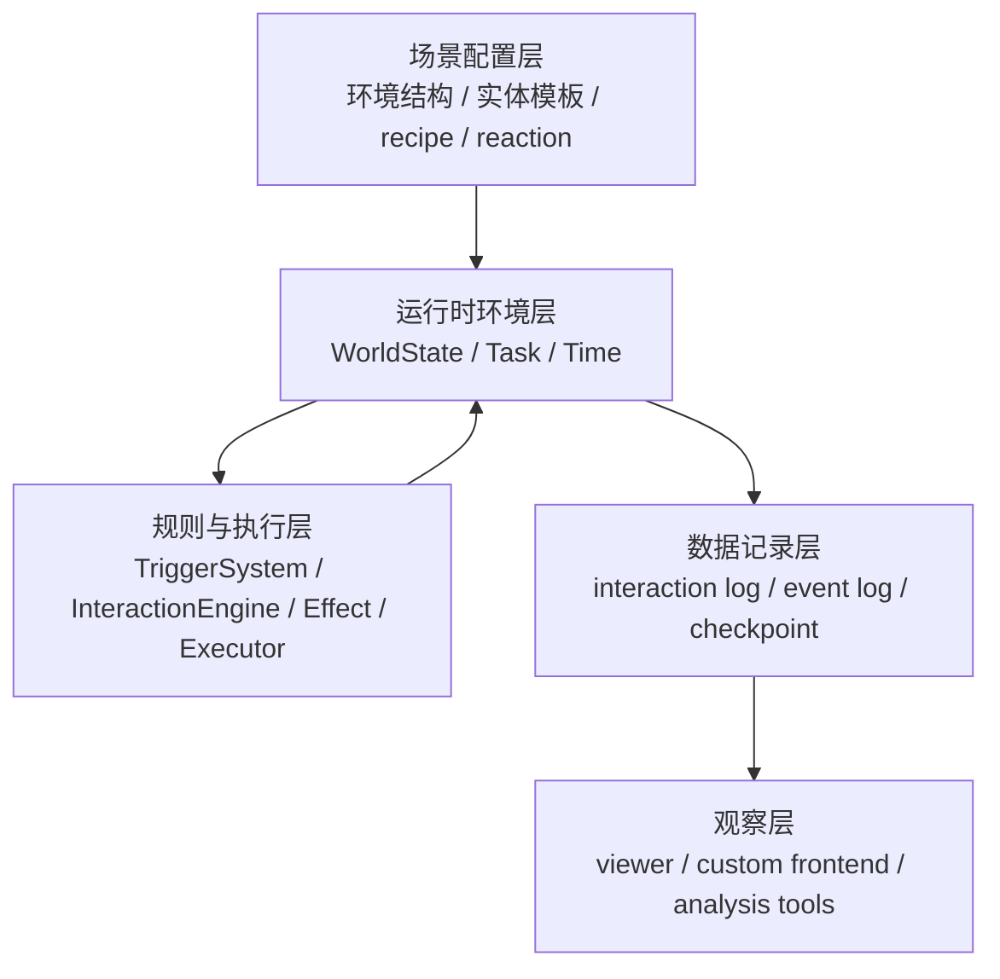
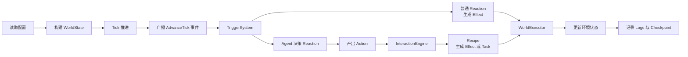
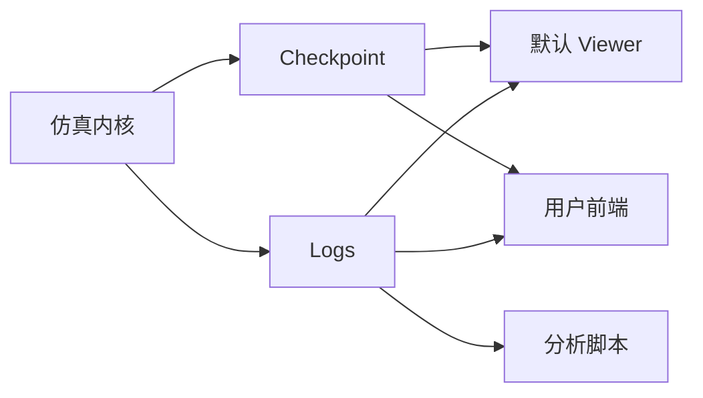

# KERN 技术报告

## 1. 简介

KERN（Knowledge, Environment, Runtime, Narrative）是一个基于 ECS 与数据驱动的离散模拟环境内核。它为多智能体与仿真实验提供了一个可配置、可重载、可观察的系统底座。

在传统多智能体实验中，场景结构、交互逻辑与状态更新流程往往被直接硬编码。这种做法导致环境设计成本高、复用性差，每当研究者需要调整地点布局、任务结构或交互规则时，都需要修改核心逻辑并重新梳理执行链。

KERN 的核心设计目标是**将环境定义与执行逻辑解耦**，提供一个更便利的框架，帮助用户在不修改核心代码的前提下快速设计、运行和调整模拟环境。具体而言，系统实现了以下特性：

- **数据驱动的环境定义**：角色、物品、地点、路径、配方与规则均通过配置（如 JSON）定义。
- **快速重载的迭代流**：支持修改配置后直接重新加载场景，大幅缩短实验验证的反馈闭环。
- **稳定的离散执行机制**：采用离散 Tick 驱动，确保环境推进、状态结算与日志记录的一致性。
- **标准化的观察接口**：输出规范的日志与 Checkpoint，使底层内核与任意可视化前端完全解耦。

## 2. 系统总体架构

KERN 采用分层组织方式。系统从配置读取开始，经过运行时环境、规则执行和日志输出，最终把结果交给观察层消费。

1. 场景配置层：定义系统运行所需的静态数据。这一层承载具体的实验内容，使不同实验场景能够共享同一套底层引擎。
2. 运行时环境层：承载仿真中的实际状态。基于 ECS（Entity-Component-System）风格组织数据，实体类型与能力通过组件组合表达。系统启动时解析配置并构建 `WorldState`，在后续 Tick 中持续更新。
3. 决策与交互层：连接环境状态与智能体行为。负责智能体的感知（Perception）、动作生成（Action），并由交互引擎将动作映射为具体的规则与执行指令。
4. 数据记录层：保存关键运行痕迹，包括记录交互叙事的 `interaction log`、记录环境事件的 `event log`，以及按 Tick 截取的环境状态快照 `checkpoint`。
5. 可视化与分析层：负责图形界面展示与数据分析。该层完全独立于仿真内核，仅消费记录层输出的数据。

## 3. 模拟环境与规则

KERN 用配置定义模拟环境。当前的环境主要由地点、路径、实体、组件、任务和规则组成。地点与路径定义离散空间结构，实体通过组件表达角色、物品、容器和状态等语义，任务用于表示跨 Tick 的持续行为。

在规则层，KERN 使用 recipe、reaction 和 effect 三个核心概念。

*(图：Agent 的主动动作与环境的被动事件分别通过 Recipe 和 Reaction 匹配，最终均转化为统一的 Effect 结构化指令，并汇入执行引擎完成世界状态的修改)*

- **recipe**：描述主动交互规则。角色提出一个 action 后，系统根据 verb、selector 和 condition 匹配对应的 recipe，并生成 effect 或 task。
- **reaction**：描述事件触发规则。环境中某个事件发生后，系统根据事件类型和条件匹配 reaction，并生成 effect。
- **effect**：描述一次结构化的状态写操作。实体移动、状态变化、任务推进、资源交换等更新都通过 effect 表达。

这套结构的结果是，主动行为和被动反应都不会直接修改环境状态。它们先生成 effect，再由统一执行器落地到 `WorldState`。

**Effect 的扩展机制**：
KERN 内置了实体移动、属性修改、资源交换、任务推进等常见 Effect。同时，系统提供了标准化的扩展入口。当用户需要引入特定的领域逻辑时，可按“Effect 类型定义 → Binder 输入归一化 → Executor Handler 执行落地”的标准链路自定义新的 Effect。这种设计略微增加了扩展成本，但保证了自定义逻辑同样享有系统的统一校验、执行与日志记录能力。

## 4. 运行流程

KERN 使用离散 Tick 推进环境。每个 Tick 都遵循相同的运行顺序。

系统启动后，首先读取配置并构建 `WorldState`。运行过程中，系统推进时间，并向环境中的实体广播 `AdvanceTick` 事件。

普通 reaction 会直接把事件转换为 effect。智能体的感知和决策也被包装成对 `AdvanceTick` 的 reaction。系统本身不关心智能体内部如何感知、记忆或推理，只关心它最终产出了什么 action。这个 action 会继续送入 `InteractionEngine`，匹配 recipe，再转换为 effect 或 task。

所有 effect 最终都会汇入 `WorldExecutor`。执行器负责修改环境状态，并把结果记录到日志和 checkpoint 中。

## 5. 解耦与扩展

KERN 的一个核心特点是边界清楚。环境定义、规则匹配、状态结算和前端展示分别处在不同层次。

环境定义和执行逻辑分离。用户通过修改配置调整环境，而不必改动内核实现。

智能体决策和仿真主循环分离。主循环只广播事件和执行 effect，不直接调用某一种固定的智能体实现。感知、记忆和决策可以由不同策略或模型提供，系统只接收 action 结果。

仿真内核和前端展示分离。内核输出 checkpoint 和日志。默认 viewer 可以使用这些数据，用户自己的前端也可以使用同样的数据接口。

这种组织方式带来了几个直接结果：环境更容易修改，场景更容易复用，前端更容易替换，新的 effect 也更容易纳入统一执行链。

## 6. 应用场景

KERN 当前使用两个场景来验证内核能力。

1. **农场场景（基础生产与交易）**：一个低复杂度测试环境，包含农田、商店、种子等实体。验证了实体移动、资源购买、种植执行等基础交互链路，以及低复杂度规则下的状态演化。
2. **太空狼人杀场景（复杂多智能体博弈）**：一个高复杂度测试环境，包含平民、内奸、任务站、武器与柜子等。验证了在信息不对称、多角色协作、冲突对抗以及复杂事件传播条件下的内核稳定性。

这两个场景共用同一套 Tick 推进、规则匹配、effect 执行和日志输出机制。变化的部分主要来自配置数据和规则定义，底层执行框架保持一致。
