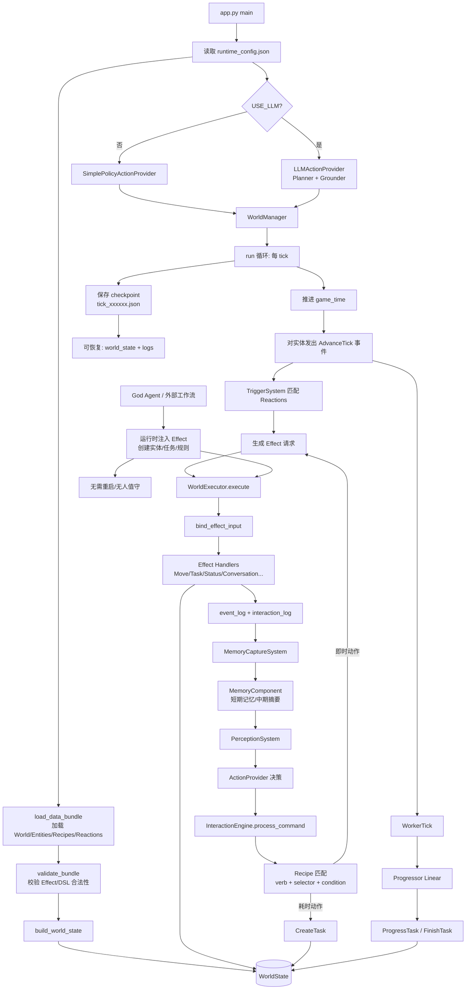
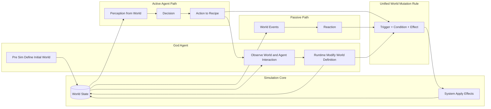

# 项目逻辑总览（当前实现）

下面图表对应当前代码实现，展示了从配置加载、数据校验、世界构建到仿真调度、决策执行与记忆回流的完整链路。

# 项目架构图（抽象视角）

下面图表只保留核心机制：世界状态修改统一走 Trigger + Condition + Effect，区分被动 Reaction 与主动 Agent，同时加入 God Agent 的两个时机。

| 框架名称 / 核心定位                               | 解决的细分痛点       |  1. 开放创造性 (生成新实体/新法则)  | 2. 物理绝对稳定 (零幻觉/代码级结算) | 3. 运行时持续演化 (在线热更新/活体宇宙) |
| :---------------------------------------- | :------------ | :--------------------: | :-------------------: | :---------------------: |
| **Concordia** (DeepMind)*纯文本DM驱动模型*       | 开放域社会互动模拟     |    ✅ *(LLM可随时脑补新事物)*   |   ❌ *(运行时极易产生物理幻觉)*   |      ✅ *(对话推动时间流逝)*     |
| **Simulation Streams** (DeepMind)*结构化流引擎* | 长序列模拟中的状态崩溃   |    ❌ *(规则写死，无法凭空造物)*   |   ✅ *(纯代码算子，100%守恒)*  |    ❌ *(仅状态变迁，法则不演化)*    |
| **AGENTGEN** (微软/HKU)*离线世界生成器*            | 智能体逻辑规划数据匮乏   |  ✅ *(能生成海量 PDDL 逻辑域)*  |   ✅ *(经典求解器保证绝对正确)*   |     ❌ *(离线生成，跑完即废弃)*    |
| **RandomWorld** (EMNLP)*逆向API生成引擎*        | 复杂工具链环境缺失     |   ✅ *(通过图论拼接无数新API)*   |    ✅ *(硬编码类型系统防崩溃)*   |   ❌ *(静态训练集，世界不自主演化)*   |
| **Codex Apeiron** (本项目)*上帝驱动的离散沙盒*        | **通用可演化世界架构** | ✅ **God Agent按需生成DSL** |   ✅ **底层ECS引擎纯代码结算**  |    ✅ **意图触发，运行时热重载**    |

目前系统已经实现了一个以 ECS 为核心的数据驱动模拟框架。

世界状态由实体、组件、位置、路径和任务等结构组成，所有状态修改统一通过受限的执行链完成，而不是由大模型直接操作内存对象。具体来说，智能体的主动行为会先经过感知、决策、交互匹配，再被翻译为结构化的 Effect；被动行为则由事件触发 Reaction，再进入同一套执行器落地到世界状态中。这样，系统将“语义决策”和“物理结算”明确分离，使仿真过程具备较强的一致性和可控性。

在当前实现中，世界知识主要以 JSON 形式描述，包括实体模板、交互配方、反应规则、任务链和地图结构等。运行时，框架会将这些配置装载为统一的 WorldState，并通过 tick 驱动的调度器持续推进模拟。每一轮推进中，系统会处理事件传播、任务进度、状态变化、交互日志和记忆更新，并支持 checkpoint 保存与恢复。因此，当前版本已经具备一个相对完整的“可运行沙盒”能力，而不只是静态规则解析器。

在智能体层面，当前系统已经支持两类控制方式：一种是简单策略驱动的自动行为，另一种是基于大语言模型的决策流程。LLM 在现阶段主要承担高层语义规划与动作选择的角色，它依据感知结果、短期记忆和可用动作集合生成命令，但不会直接修改底层世界。换言之，当前实现已经具备“LLM 负责想，执行器负责做”的基本架构雏形，并且已经验证了任务执行、对话、物品交互、状态变化和规则触发等多个闭环。

## License

This repository is licensed under `GNU GPL v3.0`. See [LICENSE](file:///e:/MyProgram/LLMSandBoxv2/LICENSE).

In addition, redistributed or publicly published modified versions must
preserve attribution to the original project name, author, and project URL
in a user-visible project document. See [NOTICE](file:///e:/MyProgram/LLMSandBoxv2/NOTICE).
